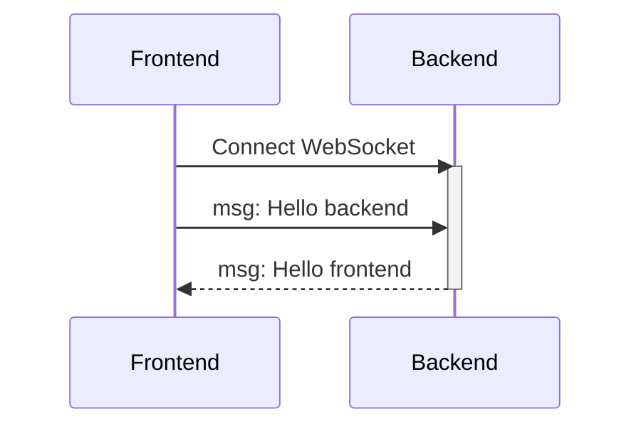
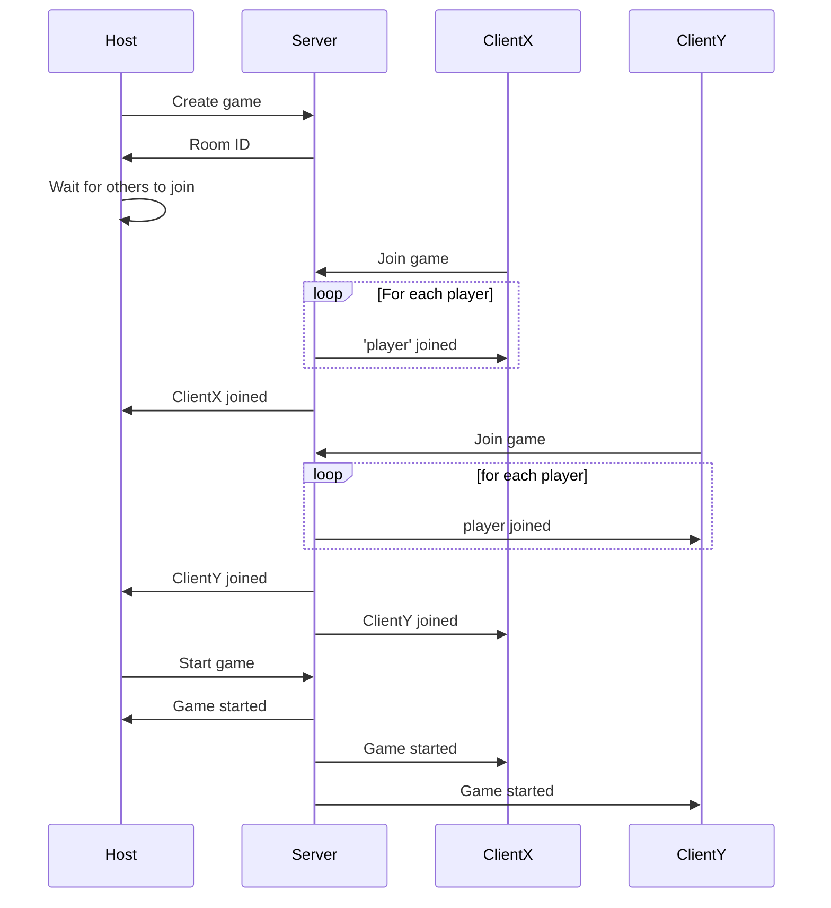

# Drunk Pandemic

Drunk Pandemic = Demic

## Pyramid

Game #1

### Diagrams

**Sequence diagram for frontend connecting to backend over WebSocket**:

```mermaid
sequenceDiagram
  participant F as Frontend
  participant B as Backend

  F->>B: Connect WebSocket
  activate B
  F->>B: msg: Hello backend
  B-->>F: msg: Hello frontend
  deactivate B
```

Create game and join flow

```mermaid
sequenceDiagram
    participant Host
    participant Server
    participant ClientX
    participant ClientY
    Host->>Server: Create game
    Server->>Host: Room ID
    Host->>Host: Wait for others to join
    ClientX->>Server: Join game
    loop For each player
        Server->>ClientX: 'player' joined
    end
    Server->>Host: ClientX joined
    ClientY->>Server: Join game
    loop for each player
        Server->>ClientY: player joined
    end
    Server->>Host: ClientY joined
    Server->>ClientX: ClientY joined
    Host->>Server: Start game
    Server->>Host: Game started
    Server->>ClientX: Game started
    Server->>ClientY: Game started
```